## Proxmox VE 7.x 相关教程

* **包括但不限于换源、直通、界面显示温度/频率等。**


***


### Proxmox VE 7.x 换源

<details>
<summary>点击展开，查看详细教程！</summary>

#### SSH登录到pve后台，然后一条一条的执行命令

#### 1.处理掉企业源
```
rm -rf /etc/apt/sources.list.d/pve-install-repo.list
```

```
echo "#deb https://enterprise.proxmox.com/debian/pve Bullseye pve-enterprise" > /etc/apt/sources.list.d/pve-enterprise.list
```


#### 2.开始换源

```
wget https://mirrors.ustc.edu.cn/proxmox/debian/proxmox-release-bullseye.gpg -O /etc/apt/trusted.gpg.d/proxmox-release-bullseye.gpg
```

```
echo "deb https://mirrors.ustc.edu.cn/proxmox/debian/pve bullseye pve-no-subscription" > /etc/apt/sources.list.d/pve-no-subscription.list
```
```
echo "deb https://mirrors.ustc.edu.cn/proxmox/debian/ceph-pacific bullseye main" > /etc/apt/sources.list.d/ceph.list
```

```
sed -i.bak "s#http://download.proxmox.com/debian#https://mirrors.ustc.edu.cn/proxmox/debian#g" /usr/share/perl5/PVE/CLI/pveceph.pm
```
```
sed -i.bak "s#ftp.debian.org/debian#mirrors.aliyun.com/debian#g" /etc/apt/sources.list
```
```
sed -i "s#security.debian.org#mirrors.aliyun.com/debian-security#g" /etc/apt/sources.list
```
```
echo "deb http://download.proxmox.com/debian/pve bullseye pve-no-subscription" >>  /etc/apt/sources.list
```


#### 3.最后更新
```
apt update && apt dist-upgrade -y
```

</details>


***


###  Proxmox VE 7.x 关订阅提示

<details>
<summary>点击展开，查看详细教程！</summary>

#### 1.WinSCP登录到PVE，编辑打开这个文件：/usr/share/javascript/proxmox-widget-toolkit/proxmoxlib.js (防止手贱，建议备份)


#### 2.搜索 data.status.toLowerCase，找到这一段：

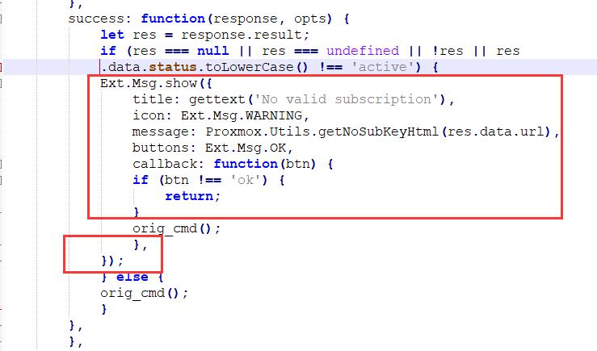

#### 3.直接删掉红框内容，变成如下图，最后保存即可。

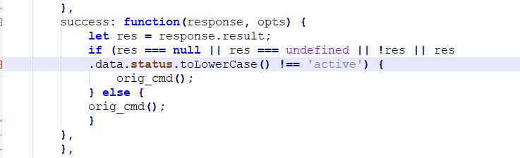

* 如果更新到PVE 7.1-5或者更新，发现改了上面的没效果，那么就要多改一步：

* 继续搜索 data.status.toLowerCase，找到这一段：

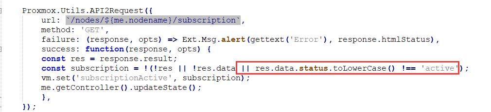

* 直接删掉红框内容，变成如下图，最后保存即可

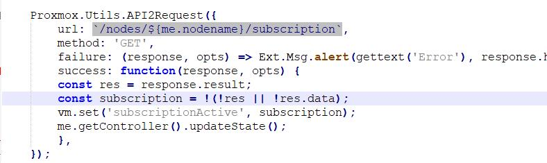

#### 4.改完保存，重进PVE界面刷新，去更新点击刷新，就没订阅提示了。

</details>


***


### Proxmox VE 主界面显示CPU温度

<details>
<summary>点击展开，查看详细教程！</summary>

#### 1.登录PVE的SSH，执行命令安装sensors：
```
apt-get install lm-sensors
```

#### 2.探测下温度，执行：`sensors-detect` (一路yes，回车)

#### 3.获取温度信息，执行：`sensors`

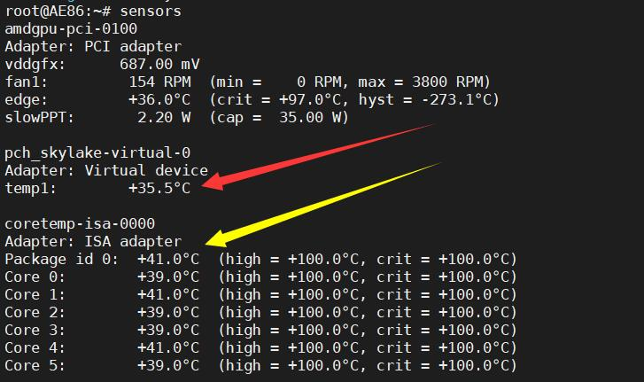

 * 红色箭头：temp1这里是主板温度，可能某些主板还有temp2、temp3等

 * 黄色箭头：Package id 0、core0~5这里是CPU温度，有多少个核心，就显示多少


#### 4.WinSCP登录到PVE，修改这个文件：/usr/share/perl5/PVE/API2/Nodes.pm 

(我习惯于下载到本地用Notepad++修改)

搜索：`$res->{pveversion} = PVE::pvecfg::package()`

在这个定义的下方添加：```$res->{thermalstate} = `sensors`;```

结果如图：

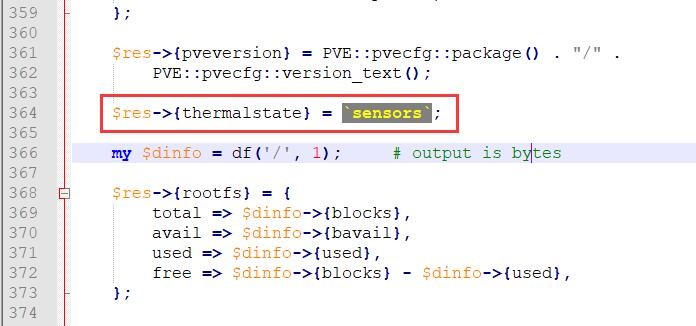


修改完保存，然后塞回路径。


#### 5.修改这个文件：/usr/share/pve-manager/js/pvemanagerlib.js (建议备份，万一自己改炸就不好了。)

(我习惯于下载到本地用Notepad++修改)

搜索`PVE Manager Version`

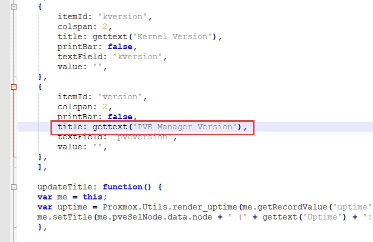

 * 在这个定义的下方添加一个定义：

```
    {
          itemId: 'thermal',
          colspan: 2,
          printBar: false,
          title: gettext('温度'),
          textField: 'thermalstate',
          renderer:function(value){
              const p0 = value.match(/Package id 0.*?\+([\d\.]+)Â/)[1];
              const b0 = value.match(/temp1.*?\+([\d\.]+)?/)[1];
              return `CPU: ${p0} ℃ || 主板: ${b0} ℃ `
            }
    },
```
结果如图：

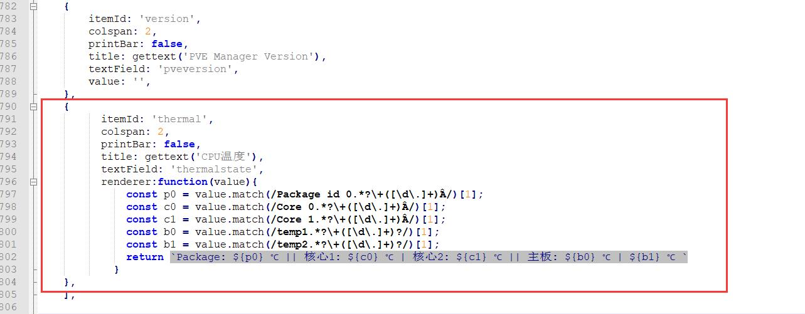

* 上述是一种比较简单的万金油做法，有些人可能要把每个核心的温度有写出来，或者说有几个主板温度，也要一起写出来，那么就按照下列的格式：

```
    {
          itemId: 'thermal',
          colspan: 2,
          printBar: false,
          title: gettext('温度'),
          textField: 'thermalstate',
          renderer:function(value){
              const p0 = value.match(/Package id 0.*?\+([\d\.]+)Â/)[1];
              const c0 = value.match(/Core 0.*?\+([\d\.]+)Â/)[1];
              const c1 = value.match(/Core 1.*?\+([\d\.]+)Â/)[1];
              const c2 = value.match(/Core 2.*?\+([\d\.]+)Â/)[1];
              const c3 = value.match(/Core 3.*?\+([\d\.]+)Â/)[1];
              const c4 = value.match(/Core 4.*?\+([\d\.]+)Â/)[1];
              const c5 = value.match(/Core 5.*?\+([\d\.]+)Â/)[1];
              const b0 = value.match(/temp1.*?\+([\d\.]+)?/)[1];
              const b1 = value.match(/temp2.*?\+([\d\.]+)?/)[1];
              return `CPU: ${p0} ℃ || CPU1: ${c0} ℃ CPU2: ${c1} ℃ CPU3: ${c2} ℃ CPU4: ${c3} ℃ CPU5: ${c4} ℃ CPU6: ${c5} ℃ || 主板1: ${b0} ℃ 主板2: ${b1} ℃`
            }
    },
```
结果如图：


* 红框内就是单独每个核心或者每个主板温度

* 前面的CPU温度是综合温度，后面的CPU1~6是每个核心单独温度

* 可根据实际情况增减CPU温度或者主板温度

* 其实如果核心超过4个，不建议把每个核心温度写出来，不美观

#### 6.改完执行 `systemctl restart pveproxy` 重进PVE主页，就看到温度显示了。

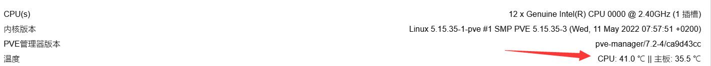


</details>


***


### Proxmox VE 主界面显示(PCI-E盘位)硬盘温度

**承接上一个显示CPU温度教程。**

* 此教程主要针对PCI-E盘位硬盘(也就是M.2固态)，SATA盘位硬盘显示温度教程在下方。

* 此教程是在上个“Proxmox VE 主界面显示CPU温度”基础上来做。

<details>
<summary>点击展开，查看详细教程！</summary>

#### * 扩展下，主界面添加M.2固态硬盘温度：

#### 1.已经完成“Proxmox VE 主界面显示CPU温度”，然后终端执行：`sensors`

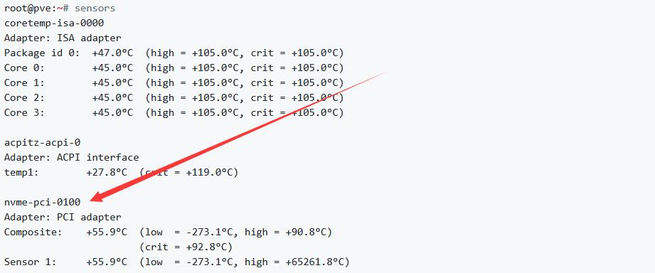

* nvme-pci-0100此处就是M.2固态温度

#### 2.修改这个文件：/usr/share/pve-manager/js/pvemanagerlib.js

在上个教程改CPU温度的定义里，加入下图红框内的内容：

`const nvme0 = value.match(/Composite.*?\+([\d\.]+)Â/)[1];`

`|| 固态: ${nvme0} ℃ `

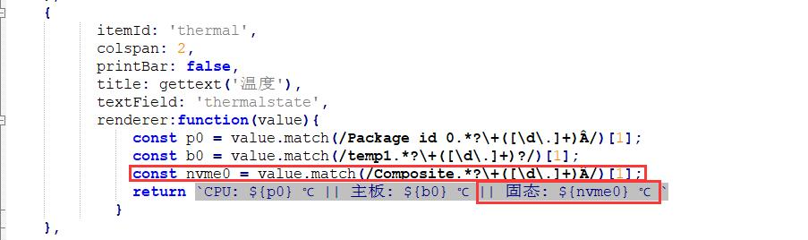

#### 3.改完保存执行`systemctl restart pveproxy`重进PVE主页。

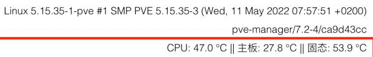

</details>


***


### Proxmox VE 主界面显示CPU频率

**承接上一个显示CPU温度教程。**

<details>
<summary>点击展开，查看详细教程！</summary>

#### * 扩展下，主界面添加CPU频率：

#### 1.也是修改 /usr/share/perl5/PVE/API2/Nodes.pm 和 /usr/share/pve-manager/js/pvemanagerlib.js 这2个文件

* /usr/share/perl5/PVE/API2/Nodes.pm 刚刚修改CPU温度那里添加：

```
$res->{cpusensors} = `lscpu | grep MHz`;
```
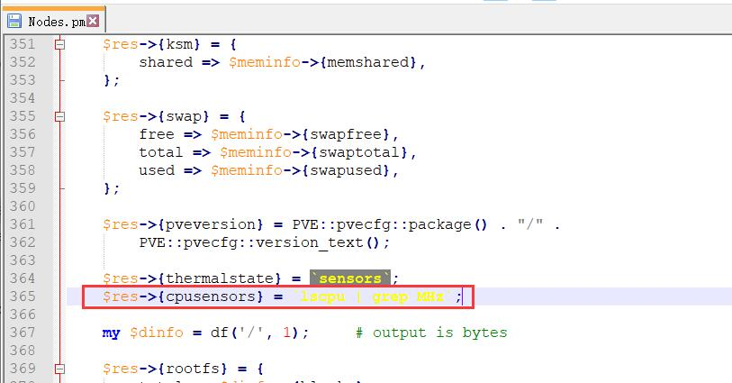

* /usr/share/pve-manager/js/pvemanagerlib.js 刚刚修改温度的下一行添加：

```
	{
          itemId: 'MHz',
          colspan: 2,
          printBar: false,
          title: gettext('CPU频率'),
          textField: 'cpusensors',
          renderer:function(value){
			  const f0 = value.match(/CPU MHz.*?([\d]+)/)[1];
			  const f1 = value.match(/CPU min MHz.*?([\d]+)/)[1];
			  const f2 = value.match(/CPU max MHz.*?([\d]+)/)[1];
			  return `实时: ${f0} MHz | 最小: ${f1} MHz | 最大: ${f2} MHz `
            }
	},
```
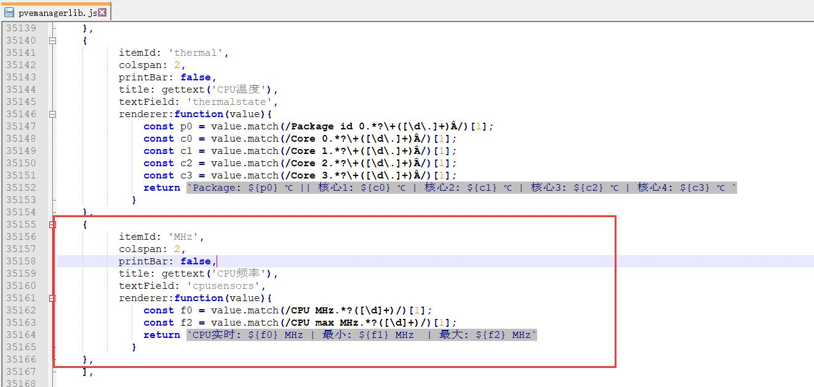

#### 2.改完执行 `systemctl restart pveproxy` 重进PVE主页，效果如图：

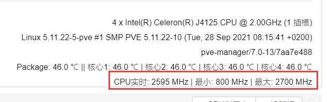

</details>


***


### Proxmox VE 主界面显示(SATA盘位)硬盘温度

**同样承接上一个显示CPU温度教程。**

* 此教程主要针对SATA盘位硬盘。

<details>
<summary>点击展开，查看详细教程！</summary>

#### * 扩展下，主界面添加硬盘温度：

#### 1.登录PVE的SSH，执行命令安装hddtemp：
```
apt-get install hddtemp
```

* 然后执行 `chmod +s /usr/sbin/hddtemp`

* 执行 `hddtemp /dev/sd?` 就能看到硬盘温度：

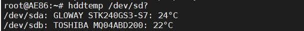


#### 2.然后修改 /usr/share/perl5/PVE/API2/Nodes.pm 和 /usr/share/pve-manager/js/pvemanagerlib.js 这2个文件

* /usr/share/perl5/PVE/API2/Nodes.pm 刚刚修改CPU温度那里添加：

```
 $res->{thermal_hdd} = `hddtemp /dev/sd?`;
```
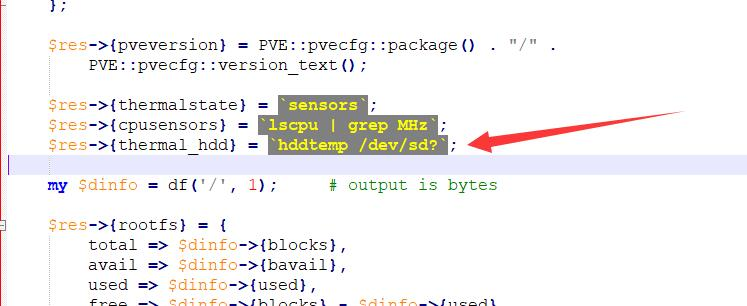

* /usr/share/pve-manager/js/pvemanagerlib.js 刚刚修改CPU温度的下一行添加：

```
	{
            itemId: 'thermal-hdd',
            colspan: 2,
            printBar: false,
            title: gettext('硬盘温度'),
            textField: 'thermal_hdd',
            renderer: function(value) {
                value = value.replaceAll('Â', '');
                return value.replaceAll('\n', '<br>');
            }
	},
```
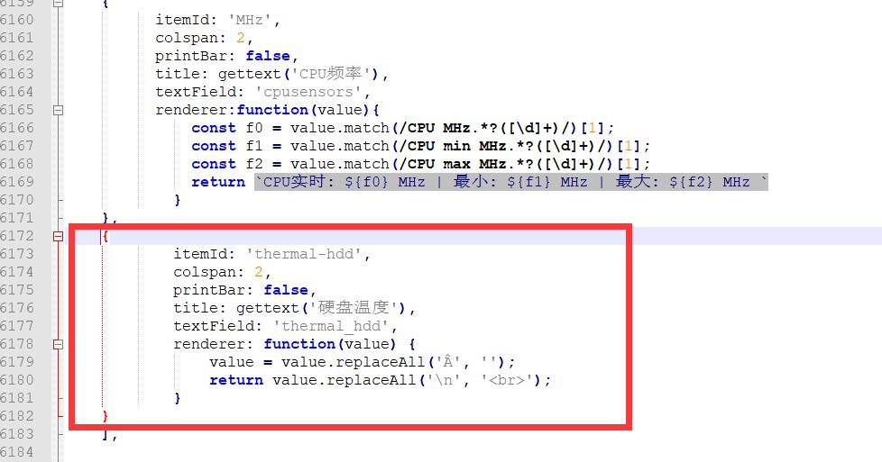

#### 3.改完执行 `systemctl restart pveproxy` 重进PVE主页，效果如图：

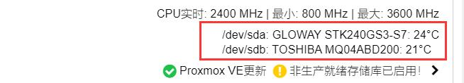


</details>


***


### Proxmox VE 改显示范围

**如果发现改上面的温度/CPU频率/硬盘温度，步骤又没错，但是主界面不显示，就需要下列教程。**

<details>
<summary>点击展开，查看详细教程！</summary>

#### 改布局：

* 还是这个文件：pvemanagerlib.js，搜索：`widget.pveNodeStatus`

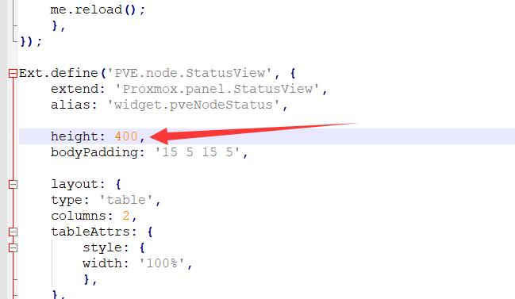

将 height: 300 改大为400，或者更大，然后保存。


* 搜索：`gettext('Status') + ': ' + zpool` (这一处不一定有，搜不到，就不用管了。)

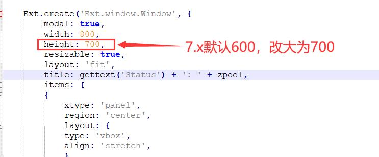

将 height: 600 改大为700，或者更大，然后保存。


</details>


***


### 核显直通(intel)

<details>
<summary>点击展开，查看详细教程！</summary>

#### 1.编辑GRUB配置文件：/etc/default/grub

```
sed -i "s/quiet/quiet intel_iommu=on iommu=pt video=efifb:off,vesafb:off/g" /etc/default/grub
```

改好结果：

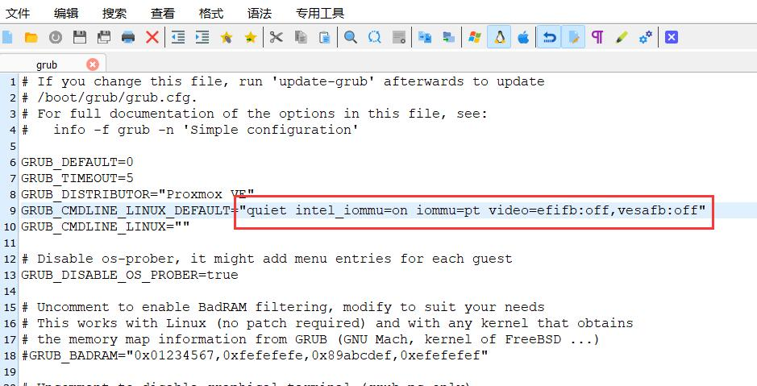


然后执行：
```
update-grub
```

#### 2.添加所需的系统模块(驱动)：/etc/modules

```
echo "vfio" >> /etc/modules

echo "vfio_iommu_type1" >> /etc/modules

echo "vfio_pci" >> /etc/modules

echo "vfio_virqfd" >> /etc/modules
```

改好结果：

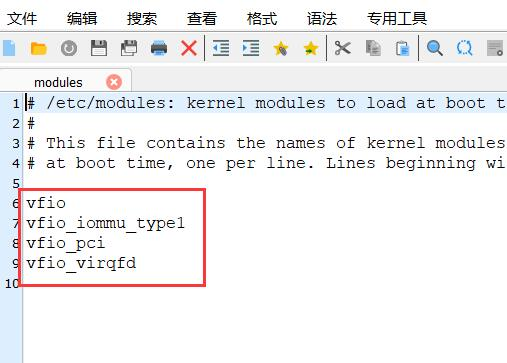


* #### PVE7.x 直接跳过3、4、5，直接到第6步即可；PVE6.x就一步步看。


#### 3.添加模块(驱动)黑名单：/etc/modprobe.d/pve-blacklist.conf

```
echo "blacklist snd_hda_intel" >> /etc/modprobe.d/pve-blacklist.conf

echo "blacklist snd_hda_codec_hdmi" >> /etc/modprobe.d/pve-blacklist.conf

echo "blacklist i915" >> /etc/modprobe.d/pve-blacklist.conf
```

改好结果：

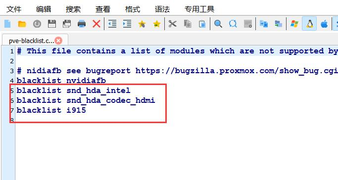


#### 4.查看GPU的ID：
```
lspci -nn | grep VGA
```

比如我的：
```
00:02.0 VGA compatible controller [0300]: Intel Corporation HD Graphics [8086:1606] (rev 08)
```
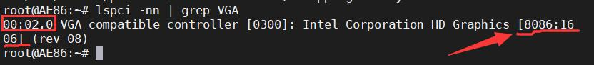

 * 8086:1606 就是核显的ID

 * 00:02.0 是核显的编号

接着执行：(ids=xxxx:xxxx，xxxx:xxxx替换成你获取的ID)
```
echo "options vfio-pci ids=8086:1606" >> /etc/modprobe.d/vfio.conf
```

#### 5.如果要音频直通，就搜索音频设备的ID
```
lspci -nn | grep Audio
```
比如我的：
```
00:03.0 Audio device [0403]: Intel Corporation Broadwell-U Audio Controller [8086:160c] (rev 08)
00:1b.0 Audio device [0403]: Intel Corporation Wildcat Point-LP High Definition Audio Controller [8086:9ca0] (rev 03)
```
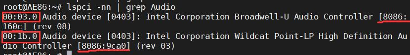

 * 8086:160c/8086:9ca0  就是音频设备ID (一个是板载，一个是单独的音频孔，所以是2个)

 * 00:03.0/00:1b.0 是音频设备编号

接着执行：(ids=xxxx:xxxx，xxxx:xxxx替换成你获取的GPU/音频设备ID，用英文逗号隔开)
```
echo "options vfio-pci ids=8086:1606,8086:160c,8086:9ca0" >> /etc/modprobe.d/vfio.conf
```

#### 6.更新内核并重启：

执行：
```
update-initramfs -u

reboot
```

#### 7.验证是否开启iommu：

终端输入：

```
dmesg | grep 'remapping'
```

要出现：DMAR-IR: Enabled IRQ remapping in x2apic mode


接着用下面的命令：
```
find /sys/kernel/iommu_groups/ -type l  
```
出现很多数据，每一行最后的xx:xx.x是设备编号，查看要直通的设备的编号是否在里面。

#### 8.添加PCI设备即可：(我只添加核显，音频设备看设备编号按需添加)


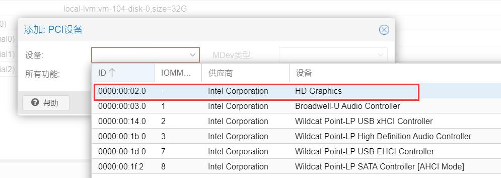


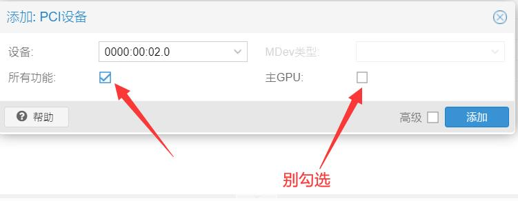


#### 9.验证核显直通成功没？

 * 在直通后的系统的终端执行：
```
ls /dev/dri
```
 * 输出如图，出现“renderD128”就成功了：

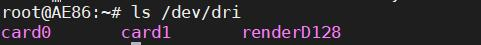

</details>


***


### 黑群晖7.x人脸识别(DS918+)

<details>
<summary>点击展开，查看详细教程！</summary>

#### 1.已经按照上面的步骤，核显直通黑裙7；

#### 2.编辑"/etc/pve/qemu-server/102.conf"文件：

* 为啥是102.conf，因为演示的黑裙7的虚拟机ID是102，根据你自己的来。

显卡hostpci0: 这一行的最后，添加：
```
,legacy-igd=1
```

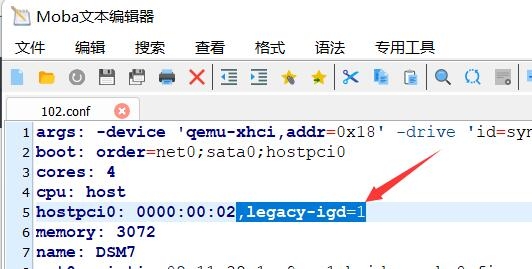

#### 3.回到PVE管理界面，更改黑裙7的硬件——显示为无，然后重启黑裙7。

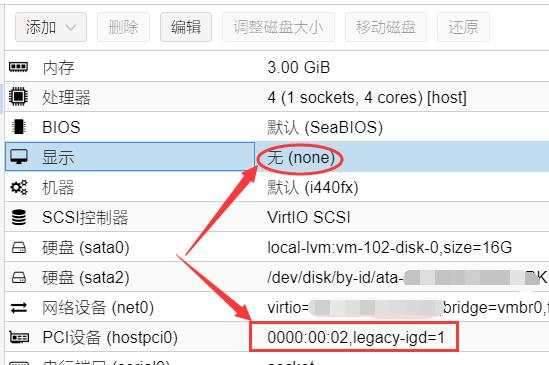

#### 4.然后等待Photos索引，就能看到人脸已经识别了。


</details>


***


### GVT-G直通(intel)

**此方式适合桌面级别的U(差不多5代起步)，小主机(J4125/N5105等)不支持！！！**

* 这种直通和上面的直通方法，二选一，不能同时选2种！！！

* 好处是显卡拆成好多个分别给不同虚拟机使用。


<details>
<summary>点击展开，查看详细教程！</summary>

#### 1.首先在主板BIOS里面启用GTD，GTX等选项，若有aperture size选项，建议512M，没有就不管吧；

#### 2.编辑GRUB配置文件：/etc/default/grub

```
sed -i "s/quiet/quiet intel_iommu=on i915.enable_gvt=1/g" /etc/default/grub
```

然后执行：
```
update-grub
```

#### 3.添加所需的系统模块(驱动)：/etc/modules

```
echo "vfio" >> /etc/modules

echo "vfio_iommu_type1" >> /etc/modules

echo "vfio_pci" >> /etc/modules

echo "vfio_virqfd" >> /etc/modules

echo "kvmgt" >> /etc/modules
```
#### 4.更新内核并重启：

执行：
```
update-initramfs -u

reboot
```

#### 5.验证是否开启GVT：

0000:00:02.0  将00:02.0换成自己的GPU的编号 (lspci -nn | grep VGA 查看，最前面的就是)

```
ls /sys/bus/pci/devices/0000:00:02.0/mdev_supported_types/
```

出现如下即为成功(教程机核显为UHD630)：

i915-GVTg_V5_4 i915-GVTg_V5_8

#### 6.配置直通：

cpu类型设置成HOST，将机器设置成q35，将虚拟机显卡设置成无，添加PCIE设备：勾选高级里的ROM-Bar和PCI-E，主GPU不勾选，MDev类型选择合适"显卡"。

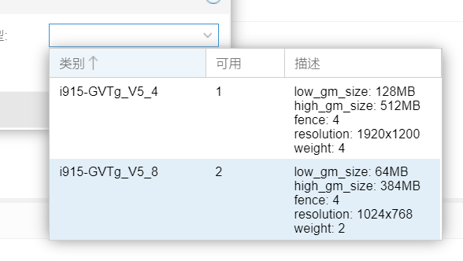

* “可用”显示的多少，就可以添加多个“显卡”。

比如上图就是说：只能添加1个v5_4的“显卡”或者添加2个v5_8的“显卡”，只能用一种类型的显卡。

</details>


***


### GVT-G改显存，增加"显卡"

**承接上一个GVT-G直通教程。**

**此教程有风险，请知悉，若操作，请自行承担风险。**

<details>
<summary>点击展开，查看详细教程！</summary>

#### 为了分配更多显卡，需给核显分配更多显存。但一般主板的BIOS并没有给调节显存的选项"aperture size"，只给了类似DVMT(共享显存)选项，最大1024MB，当把DVMT改成1024MB后，并没有用。所以本教程强行改aperture size。

通过命令 `lspci -vs 00:02.0` 查看，一般默认是256M。

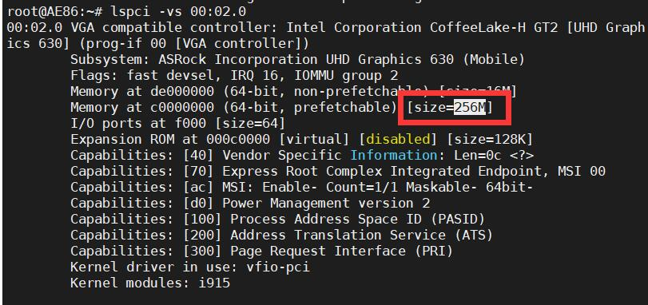

128M的显卡只有一个，所以需要改大到512M。


#### 1.自行去主板官网下载当前主板的BIOS(注意版本)，然后下载教程提供的工具包。

[工具包下载地址](https://raw.githubusercontent.com/xiangfeidexiaohuo/ProxmoxVE-7.0-DIY/master/%E6%94%B9GVT%E5%B7%A5%E5%85%B7%E5%8C%85.zip)

#### 2.使用工具包里的UEFITool0270工具，打开BIOS文件，提取模块；

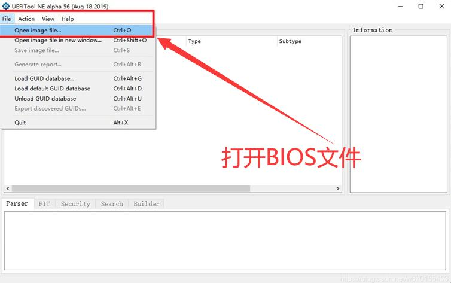

* 按Ctrl+F打开搜索页面，切换到text选项卡，搜索aperture size：

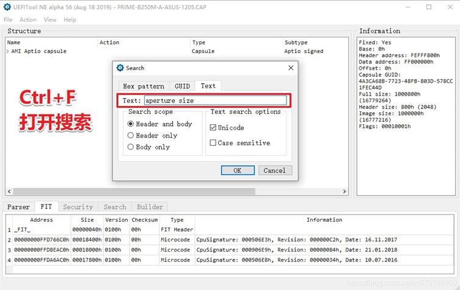

* 点击搜索出来的结果，会跳转到对应模块位置；

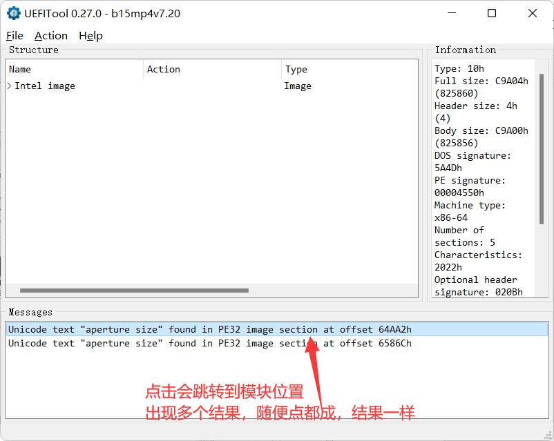

* 然后导出模块，并另存为。

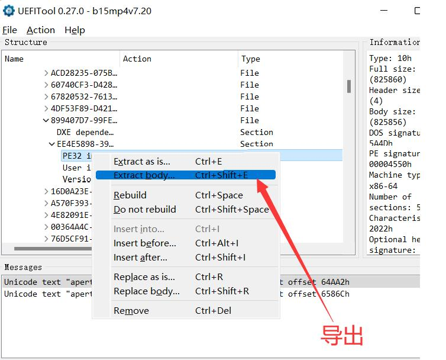

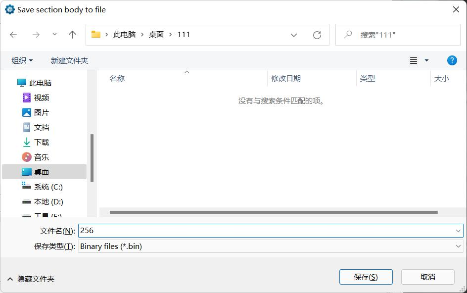

#### 3.使用工具包里的IRFExtractor.exe打开另存为的文件，找偏移量。

* 打开，并解析出文本，另存为。

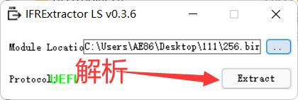

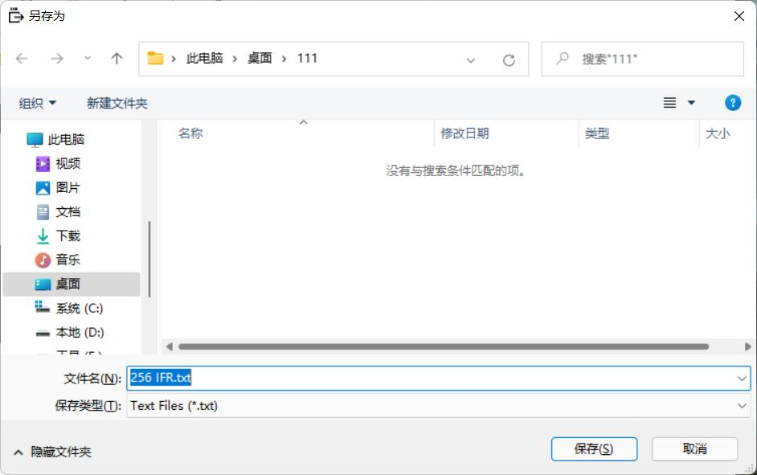

* 打开解析文本，搜索aperture size，红框内的 `0x2E8` 就是我们要找的偏移量。每个主板的BIOS偏移量不一样。

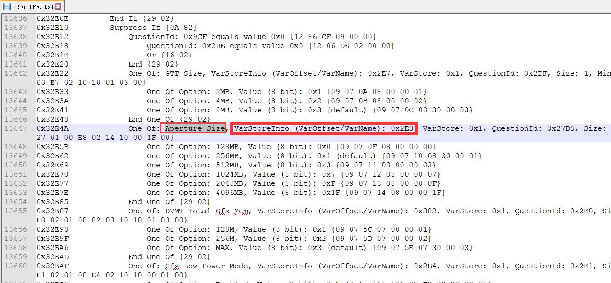

* 通过图可以看出，默认是0x1，也就是256M。若要改512M，就得默认0x3，改1G，就得默认0x7。

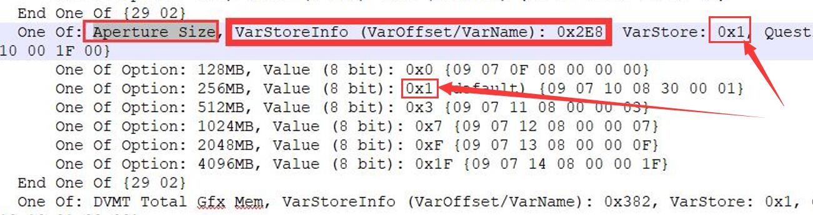

#### 4.准备一个U盘，格式化为FAT32，然后把工具包内的EFI文件夹放U盘根目录，然后电脑重启进U盘引导。

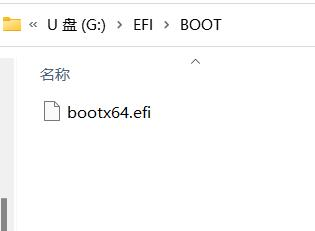

* U盘引导进入grub命令行模式，直接输入命令：`setup_var 0x2E8 0x3` ，意思就是把aperture size的偏移量默认改成0x3，也就是aperture size为512M。

* 建议只改512M，经验告诉我们改1G，可能会出问题。

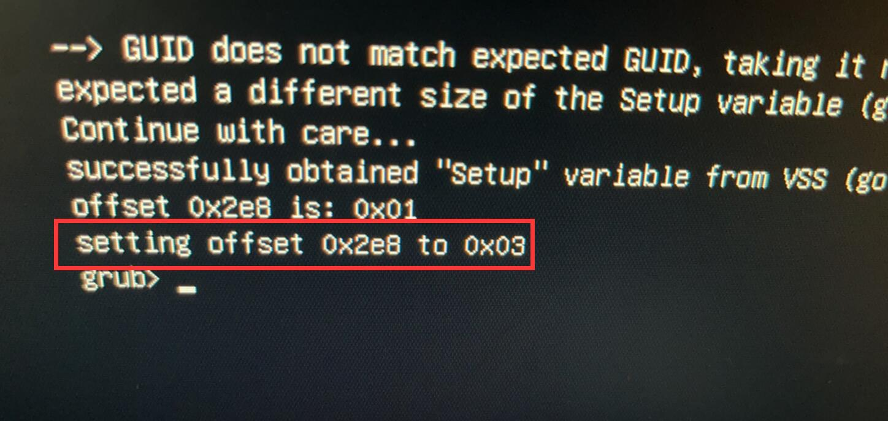

#### 5.改完成功后，开机PVE，就会看到"显卡"多了很多。

通过命令 `lspci -vs 00:02.0` 查看，已经变成512M。

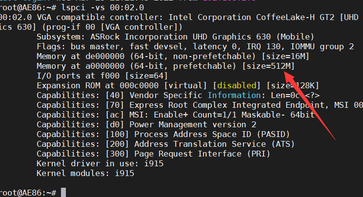

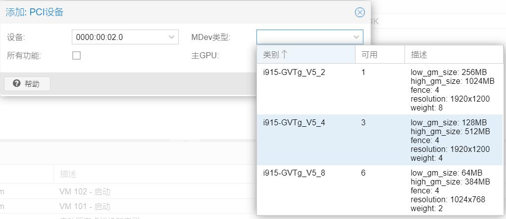


</details>


***


### GVT-G黑群辉核显直通+人脸

<details>
<summary>点击展开，查看详细教程！</summary>

#### 1.先把群辉虚拟机关机，然后硬件——显示，设为无； 然后修改虚拟机配置文件；

/etc/pve/qemu-server/102.conf (教程演示群辉虚拟机ID是102，所以是102.conf)

在配置文件第一行写入以下代码：

```
args: -device vfio-pci,sysfsdev=/sys/bus/mdev/devices/604e42e4-2e90-11ec-8861-037c58d42915,addr=02.0,x-igd-opregion=on,driver=vfio-pci-nohotplug
```
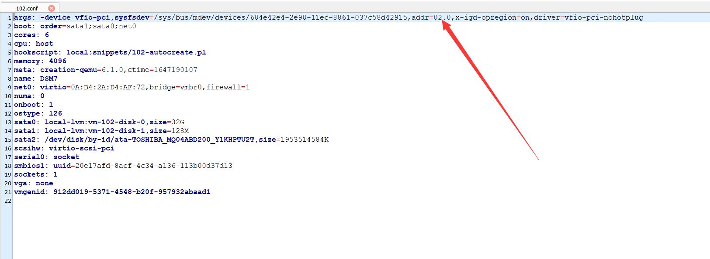

#### 2.然后PVE终端，运行命令：

```
mkdir /var/lib/vz/snippets

cp /usr/share/pve-docs/examples/guest-example-hookscript.pl /var/lib/vz/snippets/102-autocreate.pl
```

尾部的102和虚拟机ID对应；然后修改/var/lib/vz/snippets/102-autocreate.pl，在如图位置添加下列2行代码：

```
system("echo 604e42e4-2e90-11ec-8861-037c58d42915 > /sys/bus/pci/devices/0000:00:02.0/mdev_supported_types/i915-GVTg_V5_4/create");

上一行代码中的i915-GVTg_V5_4，取决于你要什么类型的显卡，V5_2/8都行。


system("echo 1 > /sys/bus/mdev/devices/604e42e4-2e90-11ec-8861-037c58d42915/remove");
```
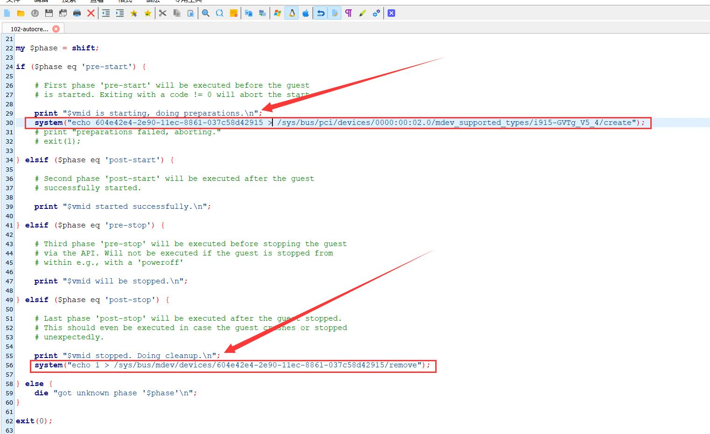


#### 3.最后终端执行：`qm set 102 --hookscript local:snippets/102-autocreate.pl` (102和虚拟机ID对应)

#### 4.群辉开机，核显已经直通，且photo人脸ok。


</details>


***


### 直通硬盘(全盘映射)

<details>
<summary>点击展开，查看详细教程！</summary>

#### 上面说了核显直通，接着说硬盘直通。前面步骤完成了，现在很简单了。

#### 1.查看读取存储设备序列号：
```
ls /dev/disk/by-id
```

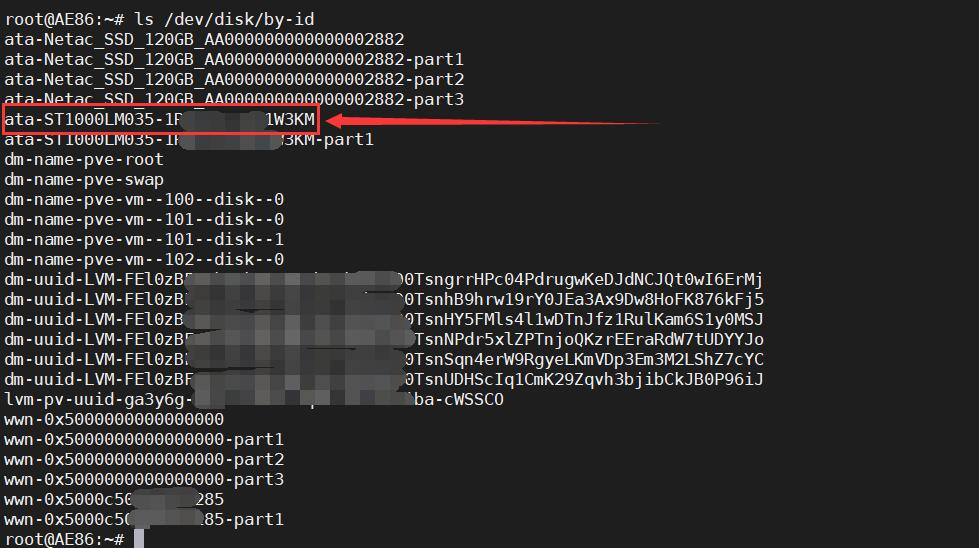


找出自己的硬盘序列号。比如我的就是：

ata-ST1000XXXXXXXXXXXXXXX

#### 2.执行命令：

 * 102：改成自己要直通硬盘的的虚拟机ID。

 * sata1：已有sata0，所以往后排，为sata1，按需修改。

```
qm set 102 -sata1 /dev/disk/by-id/ata-ST1000XXXXXXXXXXXXXXX
```

返回下面信息就说明成功挂载：

update VM 102: -sata1 /dev/disk/by-id/ata-ST1000XXXXXXXXXXXXXXX


#### 3.返回PVE查看，已经挂载，重启即可完成。

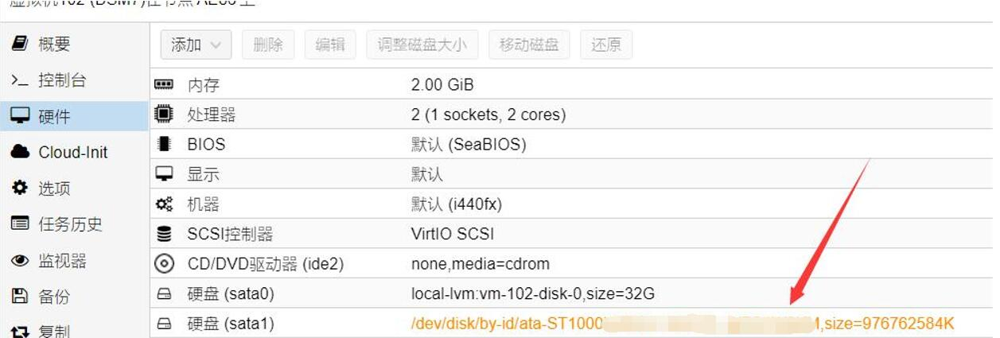

</details>


***


### PVE 直接安装Docker

<details>
<summary>点击展开，查看详细教程！</summary>

#### 1.登录PVE的SSH，输入以下命令，安装Docker：
```
curl -sSL https://get.docker.com/ | sh

chmod 777 /var/run/docker.sock

systemctl start docker

systemctl enable docker.service
```

上面的命令一条一条执行完毕后，docker就安装好了。

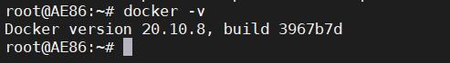


#### 2.接着终端继续输入命令，安装Portainer-CE汉化版：

```
docker run -d --restart=always --name="portainer" -p 9000:9000 -v /var/run/docker.sock:/var/run/docker.sock -v portainer_data:/data 6053537/portainer-ce
```

#### 3.等待上述安装命令执行完毕，然后打开PVE的IP地址+9000端口，进入Portainer-CE。

ps：例如我的pve的ip是192.168.100.1，那么就是进入http://192.168.100.1:9000。

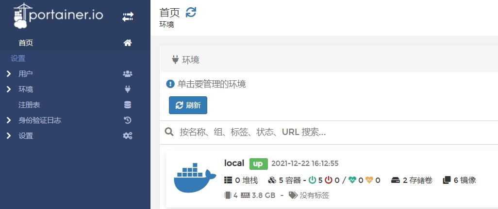

</details>


